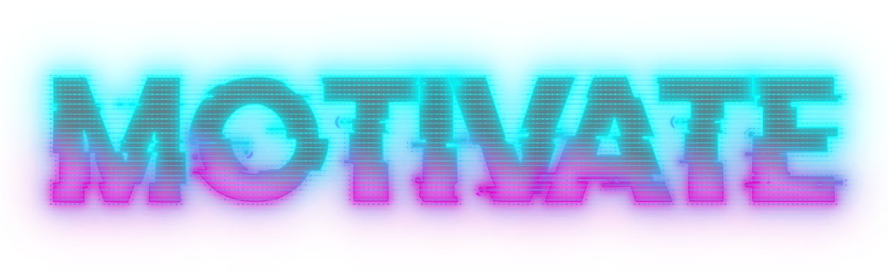
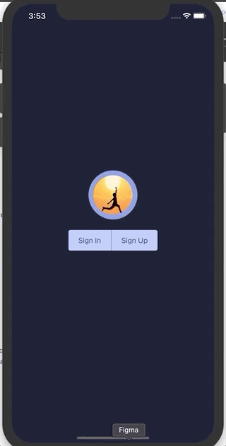

MOTIVATE является прототипом мобильного приложения для iOS/Android, которое призвано помочь в формировании полезных привычек и избавлении от вредных

#### Аутентифицируйся, зарегистрируйся или выполни вход через Google account.

#### Заполни свой профиль.

#### Добавь привычки, над которыми ты хочешь работать.  Фиксируй свои достижения в одно касание.

#### Редактируй и удаляй привычки в разделе "Details".  Следи за своим прогрессом в разделе статистики.  Мотивируйся цитатами великих людей в разделе "Quote".

### MVP функционал:

* создание, редактирование удаление привычек,
* фиксирование достижений
* просмотр прогресса

### Следующие шаги:

* деплой приложения в AppStore, GooglePlay
* расширение игрофикации приложения;
* создание web версии для более удобной работы со статистикой;

### Использованные технологии (Stack)
* React Native
* Firebase
* Redux

### Над приложением работали:

* [Денис Эпштейн](https://github.com/DenisEps)
* [Никита Ламбин](https://github.com/LamNik324)
* [Дмитрий Куприн](https://github.com/Dmitry-Kuprin)
* [Егор Богданов](https://github.com/YegorBogdanov)